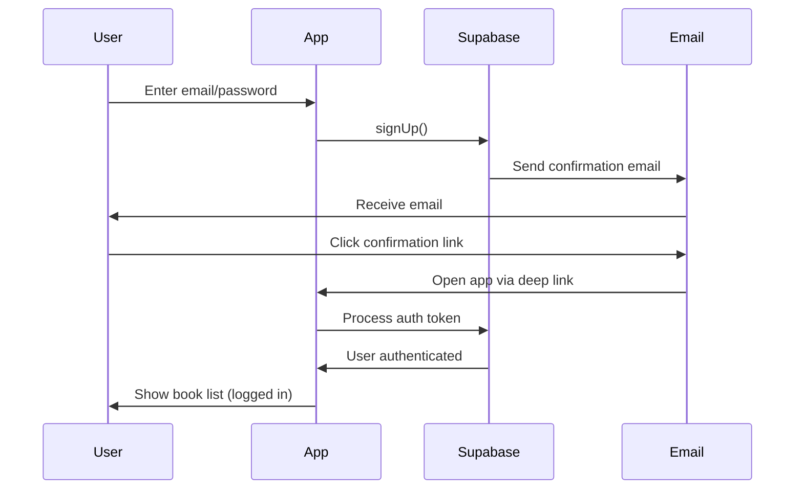

# Supabase Production Configuration for Email Confirmation

This document describes the required Supabase dashboard configuration for email confirmation deep linking to work correctly in production.

## Problem Being Solved

When users click the email confirmation link:
- ❌ **Before**: Opens browser with "error: requested path is invalid", user must manually login
- ✅ **After**: Automatically authenticates the user and redirects to the app

## Required Supabase Dashboard Configuration

### 1. Authentication Settings

Go to: **Authentication → URL Configuration** in your Supabase dashboard

#### Site URL
Set this to your production app's deep link scheme:
```
io.supabase.mybooklibrary://login-callback
```

**Important:** This is the URL that Supabase will use as the base for all redirect URLs.

#### Redirect URLs
Add the following allowed redirect URLs (one per line):
```
io.supabase.mybooklibrary://login-callback
io.supabase.mybooklibrary://**
http://localhost:*
http://127.0.0.1:*
```

**Explanation:**
- `io.supabase.mybooklibrary://login-callback` - Main deep link for email confirmation
- `io.supabase.mybooklibrary://**` - Wildcard for any path under your app scheme
- `http://localhost:*` and `http://127.0.0.1:*` - For local development/testing

### 2. Email Templates Configuration

Go to: **Authentication → Email Templates** in your Supabase dashboard

#### Confirm Signup Template
Ensure the confirmation link uses the correct redirect URL. The default template should contain:

```html
<h2>Confirm your signup</h2>

<p>Follow this link to confirm your email:</p>
<p><a href="{{ .ConfirmationURL }}">Confirm your email</a></p>
```

**Important:** The `{{ .ConfirmationURL }}` variable will automatically include the redirect URL you configured above.

#### Magic Link Template (if using)
Similar configuration for magic link authentication:

```html
<h2>Magic Link</h2>

<p>Follow this link to sign in:</p>
<p><a href="{{ .ConfirmationURL }}">Sign In</a></p>
```

#### Reset Password Template
For password reset functionality:

```html
<h2>Reset Password</h2>

<p>Follow this link to reset your password:</p>
<p><a href="{{ .ConfirmationURL }}">Reset Password</a></p>
```

### 3. Email Provider Configuration

Go to: **Authentication → Providers → Email**

Ensure these settings:
- ✅ **Email provider enabled**: ON
- ✅ **Confirm email**: ON (for production)
- ✅ **Secure email change**: ON (recommended)
- ✅ **Secure password change**: OFF (unless you want extra security)

### 4. Email Confirmation Settings

In `supabase/config.toml` (for local development):

```toml
[auth]
site_url = "io.supabase.mybooklibrary://login-callback"

[auth.email]
enable_confirmations = true  # Enable for production
double_confirm_changes = true
```

**Note:** For local testing, you can set `enable_confirmations = false` to skip email verification.

## How It Works

### 1. User Registration Flow



### 2. Deep Link Structure

When a user clicks the confirmation link in their email, they receive a URL like:

```
io.supabase.mybooklibrary://login-callback#access_token=xxx&refresh_token=yyy&...
```

The app's deep link handler:
1. Catches this URL via `app_links` package
2. Supabase SDK automatically processes the auth fragments
3. `onAuthStateChange` stream emits `Authenticated` state
4. `AuthBloc` updates and triggers navigation to home screen

## Testing the Configuration

### Local Testing (Development)

1. **Disable email confirmation** in your test Supabase project:
   ```toml
   [auth.email]
   enable_confirmations = false
   ```

2. Users will be auto-confirmed and immediately logged in

### Production Testing

1. **Enable email confirmation** in production Supabase project:
   ```toml
   [auth.email]
   enable_confirmations = true
   ```

2. Test the full flow:
   - Register a new user with a real email
   - Check email inbox (including spam folder)
   - Click the confirmation link
   - App should open and automatically log you in
   - Navigate to book list screen

### Common Issues and Solutions

#### Issue: "Requested path is invalid" error

**Cause:** Site URL or Redirect URLs not configured correctly in Supabase dashboard

**Solution:**
1. Go to Authentication → URL Configuration
2. Set Site URL to: `io.supabase.mybooklibrary://login-callback`
3. Add redirect URL: `io.supabase.mybooklibrary://**`
4. Save changes and test again

#### Issue: Browser opens but app doesn't

**Cause:** Deep link not registered in iOS/Android manifest

**Solution:**
- **Android:** Check `android/app/src/main/AndroidManifest.xml` has the intent filter (✅ already configured)
- **iOS:** Check `ios/Runner/Info.plist` has CFBundleURLTypes (✅ now configured)

#### Issue: User not automatically logged in

**Cause:** Deep link handler not processing auth token

**Solution:**
- Check `lib/main.dart` has `_initDeepLinks()` implementation (✅ now implemented)
- Verify `AuthBloc` is subscribing to `authStateChanges` stream (✅ already implemented)
- Check logs for deep link processing messages

## Code References

### Android Manifest
Location: `android/app/src/main/AndroidManifest.xml`

```xml
<intent-filter>
    <action android:name="android.intent.action.VIEW" />
    <category android:name="android.intent.category.DEFAULT" />
    <category android:name="android.intent.category.BROWSABLE" />
    <data android:scheme="io.supabase.mybooklibrary" android:host="login-callback" />
</intent-filter>
```

### iOS Info.plist
Location: `ios/Runner/Info.plist`

```xml
<key>CFBundleURLTypes</key>
<array>
    <dict>
        <key>CFBundleTypeRole</key>
        <string>Editor</string>
        <key>CFBundleURLSchemes</key>
        <array>
            <string>io.supabase.mybooklibrary</string>
        </array>
    </dict>
</array>
```

### Main App Deep Link Handler
Location: `lib/main.dart`

```dart
Future<void> _initDeepLinks() async {
  _appLinks = AppLinks();

  // Handle initial deep link if app was opened via email link
  final initialUri = await _appLinks.getInitialLink();
  if (initialUri != null) {
    await _handleDeepLink(initialUri);
  }

  // Listen for deep links while app is running
  _appLinks.uriLinkStream.listen((uri) {
    _handleDeepLink(uri);
  });
}
```

### Auth Service Configuration
Location: `lib/services/auth_service.dart`

All auth operations (signUp, resetPassword, resendConfirmation) use:
```dart
emailRedirectTo: 'io.supabase.mybooklibrary://login-callback'
```

## Deployment Checklist

Before deploying to production:

- [ ] Configure Supabase Site URL: `io.supabase.mybooklibrary://login-callback`
- [ ] Add redirect URLs in Supabase dashboard
- [ ] Enable email confirmations in production
- [ ] Test email confirmation flow with a real email
- [ ] Verify deep link opens the app (not browser)
- [ ] Confirm user is automatically authenticated
- [ ] Check user lands on book list screen after confirmation
- [ ] Test password reset flow
- [ ] Test resend confirmation email functionality

## Support and Troubleshooting

If issues persist:

1. **Check Supabase logs**: Authentication → Logs in dashboard
2. **Check app logs**: Look for "MyApp" logger messages about deep links
3. **Verify email template**: Make sure it uses `{{ .ConfirmationURL }}`
4. **Test on physical device**: Deep links may not work perfectly in emulators
5. **Clear app data**: Sometimes cached auth state can cause issues

## Additional Resources

- [Supabase Auth Deep Linking Guide](https://supabase.com/docs/guides/auth/native-mobile-deep-linking)
- [Flutter app_links Package](https://pub.dev/packages/app_links)
- [Supabase Flutter Documentation](https://supabase.com/docs/reference/dart/introduction)
